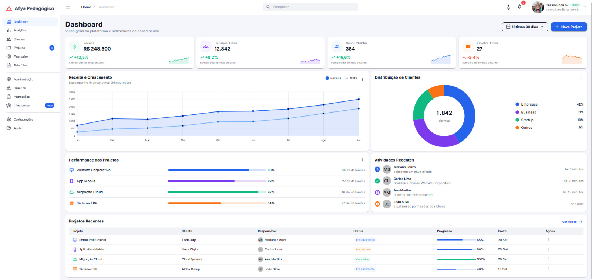
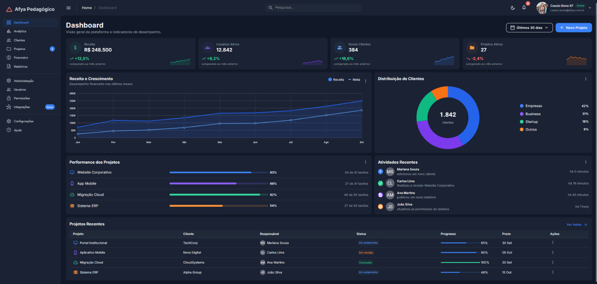
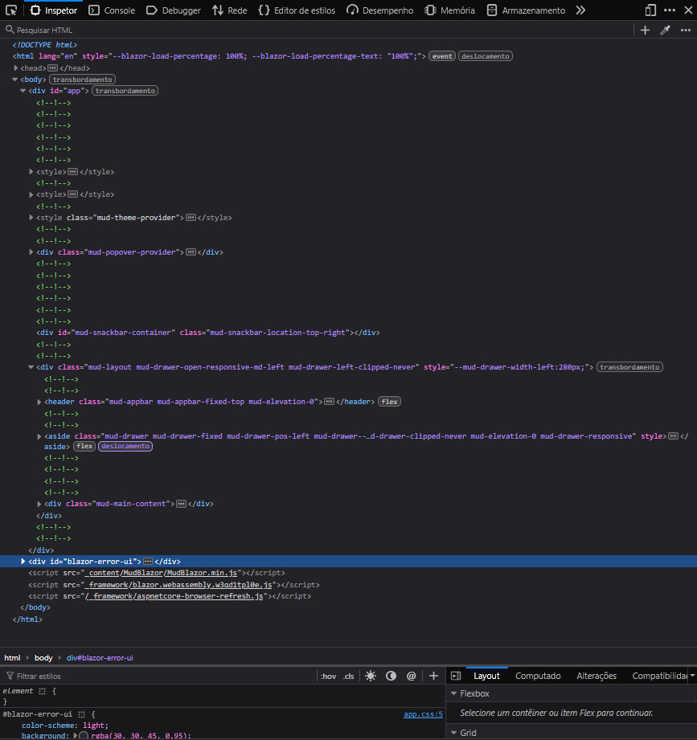

# Afya Admin — Dashboard com Blazor WebAssembly e MudBlazor

## Identificação

| | |
|---|---|
| **CASSIO BONA EULALIO** |
| **22670867** |
| **AFYA SAO LUCAS** |
| **CIENCIA DA COMPUTAÇÃO** |
| **PROGRAMAÇÃO PARA SISTEMAS WEB** |
| **LILOYOUD CURY LACERDA** |
| **2026.2** |

## Objetivo do projeto

Objetivo do projeto é a construção de um Dashboard, painel administrativo, para a Afya Pedagógico. Com foco no aprendizado de Blazor WebAssembly e Mudblazor. Objetivo foi entender como funciona e como utilizar as tecnologias, como o Blazor faz para gerar o HTML a partir do Razor.
A página reúne sidebar, AppBar, KPIs com mini gráficos, gráficos de linha e de rosca, performance dos projetos, atividades recentes e uma tabela. Tudo sem necessidade de utilizar CSS, usando apenas o MudTheme e classes do MudBlazor.

## Tecnologias utilizadas

- .NET 10 / Blazor WebAssembly
- MudBlazor 9
- C# e Razor
- Git e Github
- VSCODE com C# Dev Kit

## Como executar

Pré-requisito: .NET SDK 10 (confira com dotnet --version, que deve começar com 10.).

```bash
git clone https://github.com/caz1ogit/afya-admin.git
cd afya-admin
dotnet watch
```

## Telas

### Tema claro


### Tema escuro


### Versão mobile


### HTML gerado (DevTools)


Ao inspecionar o HTML gerado, cada parâmetro dos componentes vira uma classe CSS. O <MudPaper Elevation="1" Class="pa-4"> virou uma <div class="mud-paper mud-elevation-1 pa-4">, e o Height="100%" virou o atributo style. Os <MudStack> viraram <div> com classes de flexbox: Row="true" virou flex-row, AlignItems.Center virou align-center e Spacing="3" virou gap-3. O <MudButton> virou um <button> com mud-button-filled, mud-button-filled-primary e mud-button-filled-size-large, vindos de Variant, Color e Size. Já o <MudAvatar> do KPI recebeu a classe mud-success-hover, devolvida por Ui.FundoSuave(Color.Success), que cria o fundo verde claro sem CSS próprio.

## Estrutura do projeto

├── Components/
│   ├── AtividadesRecentes.razor
│   ├── CabecalhoPagina.razor
│   ├── DashboardCard.razor
│   ├── GraficoDistribuicaoClientes.razor
│   ├── GraficoReceita.razor
│   ├── KpiCard.razor
│   ├── PerformanceProjetos.razor
│   ├── ProjetosRecentes.razor
│   ├── SeletorPeriodo.razor
│   └── Ui.cs
├── Data/
│   └── DashboardData.cs
├── Layout/
│   ├── MainLayout.razor
│   └── NavMenu.razor
├── Pages/
│   ├── Dashboard.razor
│   └── NotFound.razor
├── Properties/launchSettings.json
├── docs/prints/
├── wwwroot/
│   ├── css/app.css
│   ├── img/alex-morgan.jpg
│   └── index.html
├── _Imports.razor
├── afya-admin.csproj
├── App.razor
└── Program.cs

## Componentes criados

DashboardCard => Card base reutilizável com título, subtítulo, ações, menu "⋮" e conteúdo: Titulo, Subtitulo, Acoes, Menu, ChildContent CabecalhoPagina => Título e subtítulo da página, com botões de ação à direita: Titulo, Subtitulo, Acoes
SeletorPeriodo => Menu com aparência de botão para escolher o período: Opcoes, Valor, ValorChanged
KpiCard => Card de indicador com ícone, valor, variação e sparkline: Kpi
GraficoReceita => Gráfico de linha Receita x Meta: Meses, Receita, Meta
GraficoDistribuicaoClientes => Gráfico de rosca com total no centro e legenda com percentuais: Total, Segmentos
PerformanceProjetos => Lista de projetos com barras de progresso: Projetos
AtividadesRecentes => Feed de atividades recentes: Atividades
ProjetosRecentes => Tabela de projetos recentes: Projetos

## O que aprendi

Responda **com suas próprias palavras** (um parágrafo curto por pergunta):

1. A aplicação Blazor WebAssembly inicia quando o navegador carrega o index.html. O arquivo carrega o script do Blazor que baixa o runtime do dotnet e arquivos da aplicação. Program.cs configura e inicia o Blazor, definindo que componentes seram renderizados dentro da div.
2. Layout é a estrutura visual compartilhada entre páginas, como a barra superior e o menu lateral. Page é uma tela acessível por uma rota, como o dashboard. Component é um pedaço reutilizável de interface, como um card de KPI ou um seletor de período.
3. RenderFragment é uma forma de passar conteúdo visual como parâmetro para um componente. O DashboardCard usa isso para ter áreas flexíveis como Menu, Acoes e ChildContent. Assim, o mesmo componente pode ser usado em vários cards com conteúdos diferentes, mantendo o mesmo estilo externo.
4. O bind Valor cria uma ligação de dois sentidos entre o componente pai e o filho. O Valor é a propriedade que recebe o valor atual. O ValorChanged é o evento que avisa o pai quando o valor mudou, permitindo atualizar a variável do pai.
5. Os dados ficam separados dos componentes para organizar melhor o projeto e facilitar mudanças futuras. Hoje eles são mocks, mas amanhã podem vir de uma API. Com essa separação, basta trocar a origem dos dados sem precisar alterar os componentes visuais.
6. O MudGrid divide a tela em até doze colunas. Cada MudItem define quantas colunas ocupar em cada tamanho de tela. Por exemplo, um item pode ocupar doze colunas no celular, seis no tablet e três no desktop, fazendo os cards se reorganizarem sozinhos conforme a largura da tela.
7. A página foi estilizada usando o tema global do MudBlazor e classes utilitárias. O tema define cores, espaçamentos, tipografia e bordas arredondadas para toda a aplicação. As classes utilitárias aplicam estilos específicos diretamente nos elementos, como centralizar, adicionar padding ou definir display flex, sem precisar criar CSS manual.
8. O namespace é afya_admin porque em C# não é permitido usar hífen em nomes de namespaces. O hífen seria confundido com operador de subtração. Por isso o dotnet substitui o hífen por underscore.

## Dificuldades e soluções

Descreva pelo menos **dois problemas** que você enfrentou durante o desenvolvimento e como resolveu cada um.

1. Erros de compilação nos componentes Razor por tags sem formatação e atributos invalidos. No performanceprojetos.razor havia uma uma string escrita de forma errada no atributo class além da tag sem fechamento.
Solução foi reescrever o componente com sintaxe correta e fechar as tags adequadamente.
2. Enfrentei o erro também da página não reconhecer a imagem, mas isto era por conta que não havia a imagem que estava sendo referenciada.
Logo riei a pagina de ntro de wwwroot com o path /img e coloquei la o images.jpg e assim ficou funcionando meu icon.